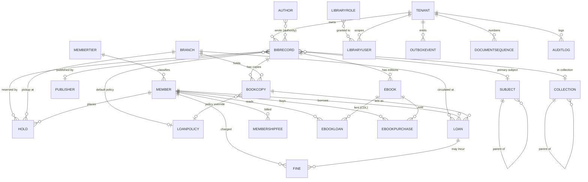

# Library Service — Entity Relationship Overview

library-api is the **single source of truth** for its own bibliographic, circulation, member and e-book data. It integrates with the rest of the platform **by reference** (auth `user_id`, marketflow `crm_contact_id`, treasury `treasury_intent_id`) and never duplicates PII.

Schemas are defined via Ent in `internal/ent/schema/`; this ERD reflects the **actual** schemas.

> **Conventions**
> - UUID primary keys (`BaseMixin`).
> - `tenant_id` on every business table (`TenantMixin`), index leads with `tenant_id`. Global reference data (`LibraryRole`) has **no** `tenant_id`.
> - Timestamps `created_at`/`updated_at` are `TIMESTAMPTZ`.
> - Money columns are `numeric(18,4)` (`moneyField`); rates are `numeric(10,4)` (`rateField`) — backed by `shopspring/decimal`, never float.

---

## Mermaid erDiagram



---

## Bibliographic Catalog (the "work")

| Table | Key Columns | Description |
|-------|-------------|-------------|
| `bib_records` | `id`, `tenant_id`, `title`, `subtitle`, `isbn10`, `isbn13`, `issn`, `lccn`, `edition`, `language`, `ddc_classification`, `lc_call_number`, `publication_year`, `page_count`, `publisher_name`, `publisher_id?`, `primary_subject_id?`, `collection_id?`, `format` (enum), `record_status` (enum), `summary`, `cover_image_url`, `authors` (JSON ordered names), `dublin_core` (JSON), `marc` (JSON MARC-lite), `default_loan_policy_id?` | Bibliographic master / title. Indexes: `(tenant_id, isbn13)`, `(tenant_id, isbn10)`, `(tenant_id, format)`, `(tenant_id, title)`. |
| `authors` | `id`, `tenant_id`, `name`, `sort_name`, `biography` | Controlled author/contributor authority. BibRecord also denormalizes display names for fast OPAC. |
| `publishers` | `id`, `tenant_id`, `name`, `place` | Controlled publisher authority. |
| `subjects` | `id`, `tenant_id`, `name`, `code`, `scheme` (LCSH/DDC/LOCAL), `parent_id?` | Hierarchical subject headings (self-referential). |
| `collections` | `id`, `tenant_id`, `name`, `code`, `parent_id?`, `is_reference_only` | Hierarchical shelving/grouping (Reference, Children's, …). `is_reference_only` copies never leave the building. |

### Enums

- **`bib_records.format`**: `PHYSICAL` (default), `EBOOK`, `AUDIOBOOK`, `PERIODICAL`.
- **`bib_records.record_status`**: `DRAFT`, `ACTIVE` (default), `ARCHIVED`, `WITHDRAWN`.

---

## Physical Holdings

| Table | Key Columns | Description |
|-------|-------------|-------------|
| `branches` | `id`, `tenant_id`, `name`, `code` (UNIQUE per tenant), `address`, `latitude`, `longitude`, `outlet_id?`, `opening_hours` (JSON per-weekday), `is_default`, `is_active` | Physical library branch/location (analogous to inventory's warehouse). `opening_hours` drives due-date rollover. `outlet_id` optionally links an auth-api outlet for outlet-scoped staff. |
| `book_copies` | `id`, `tenant_id`, `bib_record_id`, `branch_id`, `barcode` (UNIQUE per tenant), `accession_no`, `call_number`, `shelf_location`, `status` (enum), `condition`, `is_reference_only`, `acquisition_cost?`, `acquisition_date?`, `loan_policy_id?` | A physical item/holding scanned at circulation. Indexes: `(tenant_id, barcode)` unique, `(tenant_id, bib_record_id)`, `(tenant_id, branch_id, status)`. |

- **`book_copies.status`**: `AVAILABLE`, `ON_LOAN`, `RESERVED`, `IN_HOUSE`, `IN_TRANSIT`, `LOST`, `DAMAGED`, `REPAIR`, `WITHDRAWN`.

---

## Members, Tiers & Policies

| Table | Key Columns | Description |
|-------|-------------|-------------|
| `members` | `id`, `tenant_id`, `membership_no` (UNIQUE per tenant, via DocumentSequence), `user_id?` (auth ref), `crm_contact_id?` (marketflow ref/SoT), `tier_id`, `home_branch_id?`, `display_name`, `contact_phone`, `contact_email`, `status` (enum), `is_walk_in`, `joined_at?`, `expires_at?` | Library-owned patron registry. Only cached contact held — no PII duplication. Walk-in/anonymous via `is_walk_in`. |
| `member_tiers` | `id`, `tenant_id`, `name` (UNIQUE per tenant), `max_concurrent_loans`, `loan_period_days`, `max_renewals`, `hold_limit`, `ebook_concurrent_limit`, `daily_fine_rate` (rate), `max_fine_before_block` (money), `annual_fee` (money), `is_default` | Borrowing entitlements + fees per class of member. Feeds the circulation rules engine. |
| `loan_policies` | `id`, `tenant_id`, `name` (UNIQUE per tenant), `loan_period_days`, `max_renewals`, `holdable`, `fine_per_day` (rate), `grace_days`, `is_default` | Reusable circulation policy resolvable at copy → bib → tier → tenant precedence. |

- **`members.status`**: `ACTIVE`, `SUSPENDED`, `EXPIRED`, `BLOCKED`.

---

## Circulation

| Table | Key Columns | Description |
|-------|-------------|-------------|
| `loans` | `id`, `tenant_id`, `loan_no?`, `copy_id`, `member_id`, `branch_id`, `checkout_at`, `due_at`, `returned_at?`, `renewals_count`, `status` (enum), `in_house`, `checked_out_by`, `returned_by` | One copy out to one member. `in_house` = reference/reading-room session (auto-closed at branch close). Indexes: `(tenant_id, member_id, status)`, `(tenant_id, copy_id, status)`, `(tenant_id, status, due_at)`. |
| `holds` | `id`, `tenant_id`, `bib_record_id`, `member_id`, `branch_id`, `copy_id?`, `queue_position`, `status` (enum), `placed_at`, `ready_at?`, `expires_at?` | Reservation on a bib. Queues by position; promoted to READY on return with pickup expiry. `copy_id` set at fulfillment. |

- **`loans.status`**: `ACTIVE`, `RETURNED`, `OVERDUE`, `LOST`, `CLAIMED_RETURNED`.
- **`holds.status`**: `WAITING`, `READY`, `FULFILLED`, `CANCELLED`, `EXPIRED`.

### Stock/availability formula

```
A bib is "available" if any copy.status == AVAILABLE at a branch.
On checkout:  copy → ON_LOAN (or IN_HOUSE), loan ACTIVE, member's READY hold → FULFILLED
On return:    loan → RETURNED; if overdue → assess OVERDUE fine;
              next WAITING hold → READY (copy → RESERVED, 48h expiry) else copy → AVAILABLE
On renew:     due_at += loan_period_days (blocked by max_renewals or a WAITING hold)
```

---

## Money: Fines & Fees

| Table | Key Columns | Description |
|-------|-------------|-------------|
| `fines` | `id`, `tenant_id`, `member_id`, `loan_id?`, `reason` (enum), `description`, `amount` (money), `amount_paid` (money), `status` (enum), `treasury_intent_id`, `waived_by`, `assessed_at?`, `paid_at?` | Charge against a member. Settled via a treasury payment intent; `treasury.payment.succeeded` flips status → PAID (idempotent on intent id). Indexes: `(tenant_id, member_id, status)`, `(tenant_id, treasury_intent_id)`. |
| `membership_fees` | `id`, `tenant_id`, `member_id`, `period_start`, `period_end`, `amount` (money), `status` (enum), `treasury_intent_id`, `paid_at?` | Periodic membership charge (e.g. annual), settled via treasury intent. |

- **`fines.reason`**: `OVERDUE`, `LOST`, `DAMAGE`, `MEMBERSHIP`, `OTHER`.
- **`fines.status`**: `UNPAID`, `PARTIAL`, `PAID`, `WAIVED`.
- **`membership_fees.status`**: `PENDING`, `PAID`, `WAIVED`, `CANCELLED`.

---

## E-Books (Digital Shelf + CDL)

| Table | Key Columns | Description |
|-------|-------------|-------------|
| `ebooks` | `id`, `tenant_id`, `bib_record_id`, `file_url` (relative PVC path), `format` (PDF/EPUB/AUDIO), `drm_policy` (NONE/WATERMARK/TOKEN_GATED), `lending_model` (enum), `max_concurrent_loans`, `loan_duration_days`, `is_purchasable`, `price` (money), `file_size`, `checksum` | Digital edition of a bib. `lending_model=CONTROLLED_DIGITAL` caps simultaneous active loans. `is_purchasable` + `price` enable Phase-2 purchase. |
| `ebook_loans` | `id`, `tenant_id`, `ebook_id`, `member_id`, `mode` (ONLINE_READ/DOWNLOAD), `issued_at`, `expires_at`, `returned_at?`, `access_token`, `last_read_position` (JSON) | Active CDL grant. `access_token` gates the reader; progress persisted in `last_read_position`. Index `(tenant_id, ebook_id, returned_at)` backs the concurrency count. |
| `ebook_purchases` | `id`, `tenant_id`, `ebook_id`, `member_id`, `treasury_intent_id`, `amount` (money), `status` (PENDING/PAID/REFUNDED), `download_token`, `download_count`, `purchased_at?` | **Phase 2** one-time purchase, settled via treasury intent; `download_token` gates secured download, `download_count` enforces a cap. |

- **`ebooks.lending_model`**: `CONTROLLED_DIGITAL` (default), `ONE_COPY_ONE_USER`, `PURCHASE`, `OPEN`.

---

## RBAC (Global Roles + Per-Tenant Projection)

| Table | Key Columns | Description |
|-------|-------------|-------------|
| `library_roles` | `id`, `name` (UNIQUE, **no tenant_id**), `description`, `permissions` (JSON dotted codes), `is_system` | **Global** role definitions. Seeded once: `library_admin` (`*`), `library_staff`, `library_member`. |
| `library_users` | `id`, `tenant_id`, `user_id` (auth UUID/sub), `email`, `display_name`, `roles` (JSON role names), `is_active` | Per-tenant projection of an auth user, JIT-provisioned + healed on every request. Index `(tenant_id, user_id)` unique. |

---

## Platform / Infrastructure Tables

| Table | Key Columns | Description |
|-------|-------------|-------------|
| `audit_logs` | `id`, `tenant_id`, `user_id`, `aggregate_type`, `aggregate_id`, `action`, `changes` (JSON), `ip_address`, `created_at` | Records sensitive mutations (waivers, withdrawals, overrides). One table per domain via `aggregate_type`. |
| `document_sequences` | `id`, `tenant_id`, `kind` (UNIQUE per tenant), `prefix`, `next_value`, `pad_width` | Row-locked monotonic counters behind `membership_no` / `accession_no` / `loan_no`. |
| `service_configs` | `id`, `tenant_id?`, `config_key`, `config_value` (text/JSON), `config_type`, `description`, `is_secret` | Platform-level default (`tenant_id` nil) or tenant override. `is_secret` masks the value in API responses. |
| `outbox_events` | `id`, `tenant_id`, `aggregate_type`, `aggregate_id`, `event_type`, `payload` (raw JSON), `status` (PENDING/PUBLISHED/FAILED), `attempts`, `last_attempt_at?`, `published_at?`, `error_message?`, `created_at` | Transactional outbox; column layout matches shared-events' SQL outbox repository exactly (no mixins). |
| `tenants` | `id` (mirrors auth-api UUID), `slug` (UNIQUE), `name`, `region`, `is_active`, `created_at`, `updated_at` | Thin local projection of the auth-api tenant (SoT) for slug→UUID resolution + JIT. Branding not stored here. |

---

## Seed Data

`go run ./cmd/seed` is idempotent:

1. **Global library roles** are always ensured (also seeded by the API on startup via `rbac.SeedGlobalRoles`).
2. When `SEED_TENANT_ID` is set, demo data is seeded for that tenant: a default `MAIN` branch, a default `Standard` member tier (3 loans / 14 days / 2 renewals / KES 10/day fine / KES 1000 block / KES 500 annual fee), and a couple of sample bib records + copies (`The Go Programming Language`, `Things Fall Apart`).

> Catalog/member/policy data is **owned by library-api**. Other services reference it (member `user_id`/`crm_contact_id`, treasury `treasury_intent_id`) but never seed it.

---

> Update this ERD whenever Ent schemas change: run `go generate ./internal/ent/...`, then generate a versioned Atlas migration with `go run internal/ent/migrate/main.go <name>`.
